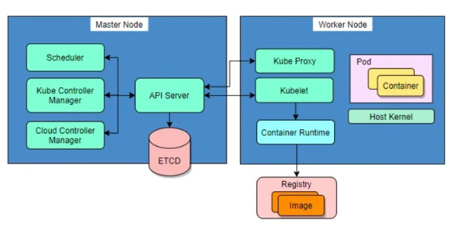

# Kubernetes Core Concepts

## Control Plane Components
The control plane manages the overall state of the cluster and consists of the following components:
- **kube-apiserver**: The core component server that exposes the Kubernetes HTTP API.
- **etcd**: A consistent and highly-available key-value store for all API server data.
- **kube-scheduler**: Looks for Pods that are not yet bound to a node and assigns each Pod to a suitable node.
- **kube-controller-manager**: Runs controllers to implement Kubernetes API behavior.
- **cloud-controller-manager (optional)**: Integrates with underlying cloud provider(s).

## Node Components
Node components run on every node, maintaining running Pods and providing the Kubernetes runtime environment:
- **kubelet**: Ensures that Pods are running, including their containers.
- **kube-proxy (optional)**: Maintains network rules on nodes to implement Services.
- **Container runtime**: Software responsible for running containers. 

## Nodes
Kubernetes runs your workload by placing containers into Pods to run on Nodes. A node may be a virtual or physical machine, depending on the cluster. Each node is managed by the control plane and contains the services necessary to run Pods.

A Kubernetes cluster consists of two types of nodes:
- **Master Node**: Hosts the Kubernetes control plane and manages the cluster, including scheduling and scaling applications and maintaining the state of the cluster.
- **Worker Nodes**: Responsible for running the containers and executing the workloads.



## What Is A Kubernetes Cluster?
Nodes usually work together in groups. A Kubernetes cluster contains a set of work machines (nodes) that automatically distribute workload among themselves, enabling seamless scaling.

## Command Line Tool (kubectl)
Kubernetes provides a command line tool for communicating with a Kubernetes cluster's control plane, using the Kubernetes API.

### Syntax
```bash
kubectl [command] [TYPE] [NAME] [flags]
```
Where:
- **command**: Specifies the operation you want to perform on one or more resources (e.g., `create`, `get`, `describe`, `delete`).
- **TYPE**: Specifies the resource type (case-insensitive; can be singular, plural, or abbreviated).
- **NAME**: Specifies the name of the resource (case-sensitive). If omitted, details for all resources are displayed (e.g., `kubectl get pods`).
- **flags**: Specifies optional flags (e.g., `-s` or `--server` to specify the address and port of the Kubernetes API server).

## What Is A Kubernetes Pod?
A Kubernetes Pod is a collection of one or more application containers. The Pod provides shared storage (volumes), an IP address, communication between containers, and hosts other information about how to run application containers. Thus, containers do not run directly on virtual machines; Pods are a way to manage containers.

### Example Pod Manifest
```yaml
apiVersion: v1
kind: Pod
metadata:
  name: examplePod
spec:
  containers:
  - name: nginx
    image: nginx:1.14.2
    ports:
      - containerPort: 80
```

## Replication Controller
A ReplicationController ensures that a specified number of Pod replicas are running at any one time, making sure that a Pod or a homogeneous set of Pods is always up and available.

### Example Replication Controller Manifest
```yaml
apiVersion: v1
kind: ReplicationController
metadata:
  name: exampleReplicationController
spec:
  replicas: 3
  selector:
    app: nginx
  template:
    metadata:
      name: nginx
      labels:
        app: nginx
    spec:
      containers:
      - name: nginx
        image: nginx
```

## ReplicaSet
A ReplicaSet's purpose is to maintain a stable set of replica Pods running at any given time, often used to guarantee the availability of a specified number of identical Pods.

### Scale the ReplicaSet
To scale the ReplicaSet, use the following command:
```bash
kubectl scale replicaset <replicaset_name> --replicas=<desired_number>
```

### Example ReplicaSet Manifest
```yaml
apiVersion: apps/v1
kind: ReplicaSet
metadata:
  name: exampleReplicaSet
spec:
  replicas: 3  # Modify replicas according to your case
  selector:
    matchLabels:
      tier: frontend
  template:
    metadata:
      labels:
        tier: frontend
    spec:
      containers:
      - name: nginx
        image: nginx
```

## Comparison: ReplicaSet vs Replication Controller

|                   Replica Set                    |               Replication Controller                          |
|--------------------------------------------------|---------------------------------------------------------------|
| Replica Set supports the new set-based selector. | Replication Controller only supports equality-based selector. |
| This gives more flexibility. For example:        | For example:                                                  |
| Environment in (production, qa)                  | Environment = production                                      |
| This selects all resources with key equal to     | This selects all resources with key equal to                  |
| environment and value equal to production or qa  | environment and value equal to production                     |

## Deployment
A Deployment manages a set of Pods to run an application workload, usually one that doesn't maintain state. 

### Use Cases for Deployments
Typical use cases for Deployments include:
- **Rollout a ReplicaSet**: Create a Deployment to rollout a ReplicaSet. The ReplicaSet creates Pods in the background. Check the status of the rollout to see if it succeeds or not.
- **Update Pods**: Declare the new state of the Pods by updating the `PodTemplateSpec` of the Deployment. A new ReplicaSet is created, and the Deployment manages moving the Pods from the old ReplicaSet to the new one at a controlled rate. Each new ReplicaSet updates the revision of the Deployment.
- **Rollback**: Rollback to an earlier Deployment revision if the current state of the Deployment is not stable. Each rollback updates the revision of the Deployment.
- **Scale Up**: Scale up the Deployment to facilitate more load.
- **Pause and Resume Rollout**: Pause the rollout of a Deployment to apply multiple fixes to its `PodTemplateSpec` and then resume it to start a new rollout.
- **Monitor Rollout Status**: Use the status of the Deployment as an indicator that a rollout has stuck.
- **Cleanup**: Clean up older ReplicaSets that you don't need anymore.

### Example Deployment Manifest
```yaml
apiVersion: apps/v1
kind: Deployment
metadata:
  name: exampleDeployment
spec:
  replicas: 3
  selector:
    matchLabels:
      app: nginx
  template:
    metadata:
      labels:
        app: nginx
    spec:
      containers:
      - name: nginx
        image: nginx:1.14.2
```

## Namespaces
In Kubernetes, namespaces provide a mechanism for isolating groups of resources within a single cluster. Names of resources need to be unique within a namespace but not across namespaces. Namespace-based scoping is applicable only for namespaced objects (e.g., Deployments, Services) and not for cluster-wide objects (e.g., StorageClass, Nodes, PersistentVolumes).

Namespaces are a way to divide cluster resources between multiple users (via resource quota). It is not necessary to use multiple namespaces to separate slightly different resources, such as different versions of the same software; use labels to distinguish resources within the same namespace.

```bash
kubectl create namespace NAME
```